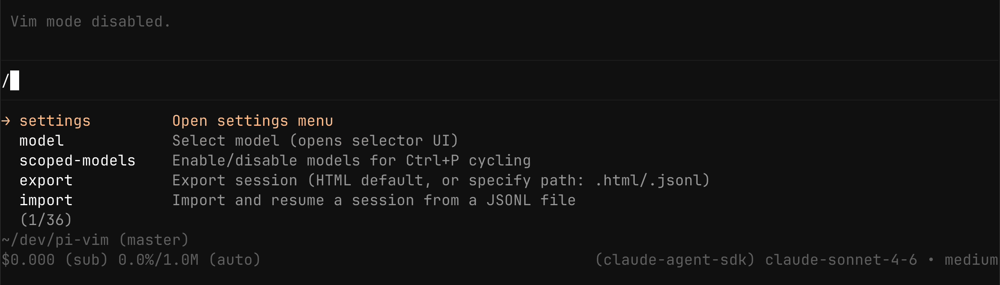

# pi-vim

[](https://www.npmjs.com/package/@leohenon/pi-vim) [](https://nodejs.org)

Vim mode for [pi](https://github.com/badlogic/pi-mono).

Normal, insert, visual, and replace modes with motions, text objects, yank/put, and undo/redo.

## Demo



## Install

```bash
pi install npm:@leohenon/pi-vim
```

## Usage

Toggle with:

```text
/vim-mode
```

## Insert mode

- `Esc` / `Ctrl-[` → normal mode
- `Shift+Alt+A` → line end
- `Shift+Alt+I` → line start
- `Alt+o` → open line below
- `Alt+Shift+O` → open line above

## Normal mode

### Mode

- `i`, `a`, `I`, `A`
- `o`, `O`
- `v` → visual
- `V` → visual line
- `R` → replace

### Motions

- `h`, `j`, `k`, `l`
- `w`, `b`, `e`
- `W`, `B`, `E`
- `0`, `^`, `_`, `$`
- `gg`, `G`
- `f`, `F`, `t`, `T`
- `;`, `,`
- counts on motions

### Delete

- `dd`, `dw`, `de`, `db`, `dW`, `dE`, `dB`
- `d0`, `d^`, `d$`, `d_`, `dG`
- `d{count}j`, `d{count}k`
- `df`, `dF`, `dt`, `dT`
- `diw`, `daw`, `di"`, `da"`, `di'`, `da'`, ``di` ``, ``da` ``, `di(`, `da(`, `di[`, `da[`, `di{`, `da{`

### Change

- `cc`, `cw`, `ce`, `cb`, `cW`, `cE`, `cB`
- `c0`, `c^`, `c$`, `c_`
- `cf`, `cF`, `ct`, `cT`
- `ciw`, `caw`, `ci"`, `ca"`, `ci'`, `ca'`, ``ci` ``, ``ca` ``, `ci(`, `ca(`, `ci[`, `ca[`, `ci{`, `ca{`

### Yank

- `yy`, `Y`
- `yw`, `ye`, `yb`, `yW`, `yE`, `yB`
- `y0`, `y^`, `y$`, `y_`, `yG`
- `y{count}j`, `y{count}k`
- `yf`
- `yiw`, `yaw`, `yi"`, `ya"`, `yi'`, `ya'`, ``yi` ``, ``ya` ``, `yi(`, `ya(`, `yi[`, `ya[`, `yi{`, `ya{`

### Edit

- `x`, `s`, `S`
- `r{char}`
- `R` → replace mode
- `~` → toggle case
- `D`, `C`
- counts on `x`, `r`, `~`

### Put

- `p`, `P`
- counts on `p`, `P`

### Undo

- `u`, `Ctrl-_`
- `Ctrl-r`
- counts on undo/redo

## Visual mode

### Characterwise

- `v` enters visual mode
- `Esc` exits to normal mode
- `d` / `x` delete selection
- `y` yank selection
- `c` change selection
- `p`, `P` replace selection with unnamed register

### Linewise

- `V` enters visual line mode
- `j`, `k` extend by full lines
- `Esc` exits to normal mode
- `d` / `x` delete selected lines
- `y` yank selected lines
- `c` change selected lines
- `p`, `P` replace selected lines

> [!NOTE]
> yanks and puts use an internal unnamed register, not the system clipboard

## Files

```text
pi-vim/
  index.ts
  package.json
  README.md
```

> [!NOTE]
> If you run into any bugs, please open an issue.

## License

MIT
